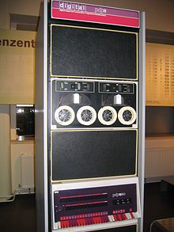

# What is computer?

A computer is a machine that can be instructed to run sequence of operations automatically through computer programming.

Before early 20th century, some [analog computers](https://en.wikipedia.org/wiki/Analog_computer) were invented. Some examples:

- [Sir William Thomson](https://en.wikipedia.org/wiki/William_Thomson,_1st_Baron_Kelvin)'s third tide-predicting machine design, 1879–81

    

- A portion of [Babbage](https://en.wikipedia.org/wiki/Charles_Babbage)'s [Difference engine](https://en.wikipedia.org/wiki/Difference_engine).

    

## Modern Computer

The principle of modern computer was proposed by [Alan Turing](https://en.wikipedia.org/wiki/Alan_Turing) in 1936.

The [Von-Neumann](https://en.wikipedia.org/wiki/John_von_Neumann) architecture is an architecture for constructing actual computers (which implement what the Turing machine describes theoretically).

### Form-factors

There are different ways to classified computers. This section describes computers by size (aka form-factor).

- [Mainframe computer](https://en.wikipedia.org/wiki/Mainframe_computer)

Appears in 1950s, mainframe computers are not as populated as in before but still being used in big banks, government, and etc.

An IBM System z9 mainframe

- [Supercomputer](https://en.wikipedia.org/wiki/Supercomputer)

A supercomputer is designed to have high level of performance as compared to a general-purpose computer. As fast as possible is its character while mainframe computer is designed to be reliable.

IBM Blue Gene/P supercomputer

- [Minicomputer](https://en.wikipedia.org/wiki/Minicomputer)

Built since 1960s, minicomputer is much smaller and much less expensive than mainframe computer. Since 1980s, it was replaced by workstations and PCs.

A PDP-11, model 40, an early member of DECs 16-bit minicomputer family

- [Microcomputer](https://en.wikipedia.org/wiki/Microcomputer)

A microcomputer is a small computer with a microprocessor as its central processing unit (CPU). It includes a microprocessor, memory and minimal input/output (I/O) circuitry mounted on a single printed circuit board(PCB). It became popular since 1970s. Personal computer (PC) and Laptop are microcomputers for residential usage.

The Commodore PET 2001, the Apple II, and the TRS-80 Model 1.

- [Workstation](https://en.wikipedia.org/wiki/Workstation)

A workstation is a special computer designed for technical or scientific applications. It is intended to be used by one person at a time and usually for professionals.

Sun [SPARCstation](https://en.wikipedia.org/wiki/SPARCstation) 10 with [CRT monitor](https://en.wikipedia.org/wiki/CRT_monitor)

- [Personal computer](https://en.wikipedia.org/wiki/Personal_computer)

A personal computer (PC) is a multi-purpose computer intended to be used by end user rather than computer expert or technician. Unlike large costly minicomputer and mainframes, time-sharing by many people at the same time is not used with personal computers.

Desktop-style personal computer

- [Laptop](https://en.wikipedia.org/wiki/Laptop)

A laptop computer is a small, portable [personal computer](https://en.wikipedia.org/wiki/Personal_computer) (PC).

A Lenovo laptop

- [Tablet computer](https://en.wikipedia.org/wiki/Tablet_computer)

A tablet computer, commonly shortened to tablet, is a mobile device, typically with a mobile operating system and touchscreen display and a rechargeable battery in one thin and flat package.

Apple's [iPad](https://en.wikipedia.org/wiki/IPad) (left) and Amazon's [Fire](https://en.wikipedia.org/wiki/Fire_HD) (right), two popular tablet computers.

- [Smartphone](https://en.wikipedia.org/wiki/Smartphone)

Smartphones are a class of [mobile phones](https://en.wikipedia.org/wiki/Mobile_phone) and of multi-purpose mobile computing devices. It is usually smaller than a tablet computer and most of tablet computer do not have cellular telephony, Two popular smartphones are [iphone](https://en.wikipedia.org/wiki/iphone) and [android](https://en.wikipedia.org/wiki/android) based phones.

- [Single-board computer](https://en.wikipedia.org/wiki/Single-board_computer)

A single-board computer (SBC) is a complete computer built on a single circuit board, with microprocessor(s), memory, input/output (I/O) and other features required of a functional computer.

The Raspberry Pi

- [Microcontroller](https://en.wikipedia.org/wiki/Microcontroller)

A microcontroller (MCU for microcontroller unit) is a small computer on a single metal-oxide-semiconductor (MOS) integrated circuit (IC) chip.

[Arduino](https://en.wikipedia.org/wiki/Arduino) Uno SMD R3 is a very popular single-board microcontrollers.
