# Personal Computer Hardware

This document describes the main hardware components in personal [desktop computer](https://en.wikipedia.org/wiki/Desktop_computer) (PC). [Laptop computer](https://en.wikipedia.org/wiki/Laptop) has the same types of the components but they are more compact, portable and lower power consumption.

- Desktop Computer

- Laptop Computer

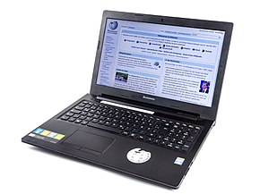

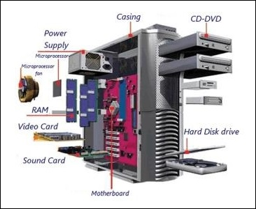

## Case

Computer case is a box holds most of the components like motherboard, internal storage device, power supply, and etc.

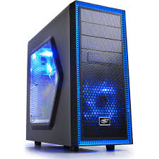

A desktop computer case

## Power supply

A power supply unit (PSU) converts alternating current (AC) electric power to low-voltage direct current (DC) power for the internal components of the computer. Laptops also has a built-in battery providing power when there is no external electric power.

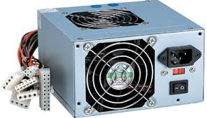

Power supply unit

## Motherboard

The motherboard is the main component of a computer. It is a board with integrated circuitry that connects the other parts of the computer including the CPU, the RAM, the disk drives (CD, DVD, hard disk, or any others) as well as any peripherals connected via the ports or the expansion slots.

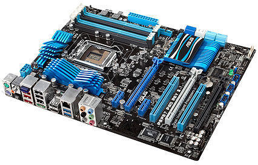

Desktop motherboard​​​​​

Computer motherboard

### Central Processing Unit - CPU

As a brain of the computer performing most of the calculations. It read the program instruction from RAM, interprets and processes it, and send back the computing result to the relevant components.

It can become very hot and must be cooled by a heat sink and fan (or water-cooling system). New CPU also contains [graphic processing unit (GPU)](https://en.wikipedia.org/wiki/Graphics_processing_unit), which is responsible for creating images  and render on display device.

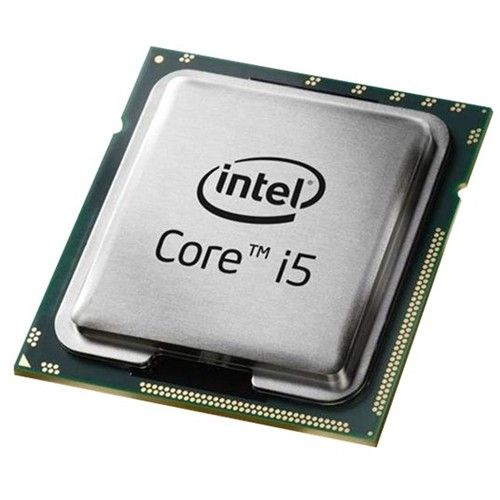

Intel CPU

### Chipset

Chitset is a set of electronic components in an integrated circuit.

- North bridge

Mediates communication between the CPU and the other components like main memory

- South bridge

Connected to the north bridge, and supports auxiliary interfaces and buses; and, finally, a Super I/O chip, connected through the south bridge, which supports the slowest and most legacy components like serial ports, hardware monitoring and fan control.

### Random access memory - RAM

It is computer's internal memory that stores the code and data accessed by the CPU. Now the typical RAM size is in unit GB, like 8GB or 16GB. The information it holds is cleared when computer is turned off.

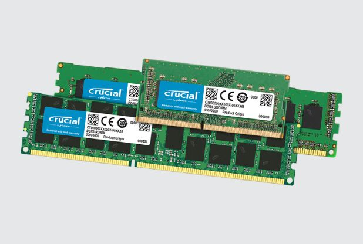

Desktop and Laptop Memory

### Read only memory - ROM

It stores program ([BIOS](https://en.wikipedia.org/wiki/BIOS)) that runs when the computer is powered on or otherwise begins execution (bootstrapping or booting). The BIOS (Basic Input Output System) includes boot firmware and power management firmware. Newer motherboards use [Unified Extensible Firmware Interface (UEFI)](https://en.wikipedia.org/wiki/Unified_Extensible_Firmware_Interface) instead of BIOS.

### Buses

They are the circuits connect the CPU to various internal components and to expand cards for graphics and sound.

### Video/Graphic Card - GPU

It processes computer graphics. It has [GPU](https://en.wikipedia.org/wiki/Graphics_processing_unit) and has connector to display device like computer monitor. It can be either embedded in motherboard or as a expansion card.

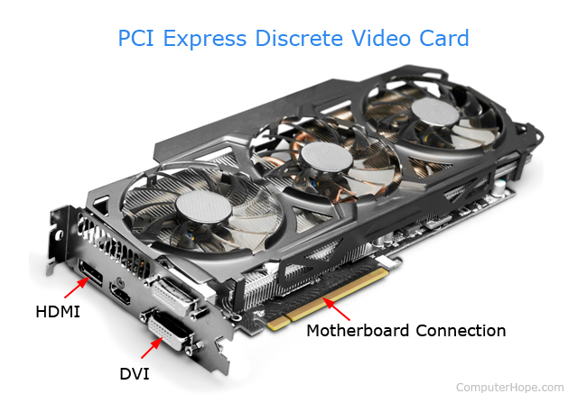

PCI Express Video Card

## Expansion cards

They are circuit board that can be inserted into an expansion slot of a computer motherboard that provide features not offered by motherboard. Typical expansion card is video card.

## Storage devices

Different from RAM, the information stored are kept even when computer is turned off.

- Fixed media - internal
    - Hard drive (HDD): electro-mechanical device uses magnetic storage
    
    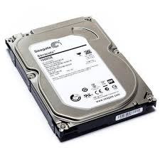

    - Solid-state (SSD): integrated circuit device, it is newer, faster and more power efficient than HDD

    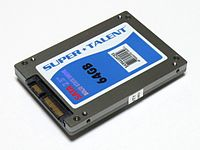

- Removable media - externalHDD 3.5 inch
    - USB
    - CD/DVD

    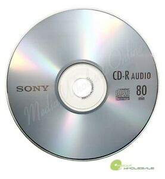

    CD/DVD

    - External HDD/SDD

## Input and output peripherals (IO devices)

Input and output devices are typically housed externally to the computer case.

### Input device

Allow user to enter information into computer system like mouse, keyboard, scanner, camera, microphone, and etc.

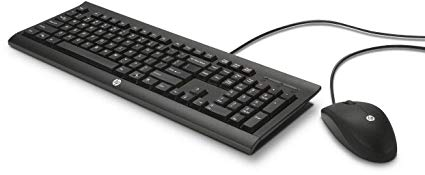

Keyboard and Mouse

### Output device

Display information from computer into human readable form. like printer, speaker, monitor, and etc.

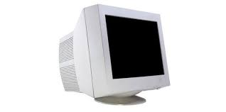

CRT Monitor

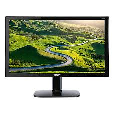

LCD/LED Monitor

