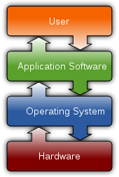

# What is computer software?

Software is a collection of data or instructions that tell the computer how to work.Software It has two main categories:

- Application Software
- Operating System (OS)

OS Place Software

## Application Software

Applications are the programs run directly run by user on computer.

- Web browser
- MS Office (Word, Excel, Outlook)
- Mail
- Games

## Operation System

OS is system software that manages computer hardware, software resources, and provides common services for applications.

## PC

- Windows (Microsoft)
- Linux (Ubuntu, Redhat)
- Mac OS (Apple)

## Mobile Device

- iOS (IPhone)
- Android (Google)
