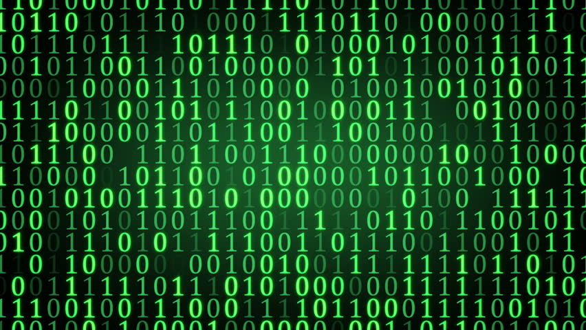

# What is programming language?

Programming language comprises [a set of instructions](https://en.wikipedia.org/wiki/Instruction_set) for computer to produce various kinds of output.

Computer (CPU) only understand instructions in binary code. Binary code is hard for human being to create and manage. Programming languages are created as an bridge from human language to the binary code, which computer can understand and execute directly.

Programming languages must be translated to the binary code before computer can run it. This translation is call "compiled" or "interpreted". No matter what programming language used, you must use a compiler or interpreter to convert it into a form that computer can understand, which is binary code.

Binary code

## Popular languages

here have been many computer languages created. Lots of them are not being actively used, while some are still very popular.

### C/C++

C is a general purpose procedural programming language. First developed at early 1970s, it is still being used widely used various platforms, especially in OS and device driver level.

C++ is an extension of the C language. It is object oriented and also available on various platforms.

### Java

First developed in 1995, Java is a general purpose, class-based object oriented language. The compiled code from Java program is not binary code, but [JVM](https://en.wikipedia.org/wiki/Java_virtual_machine) byte-code. It can be run on any computer system that has JVM installed.

Java has very wide application on desktop application, web application, and mobile app.

### .NET

.Net is __a set of programming languages__ that can run on Microsoft .Net framework.

### Python

Python is an interpreted general purpose language created in 1991. It was designed to write easy to understand program.